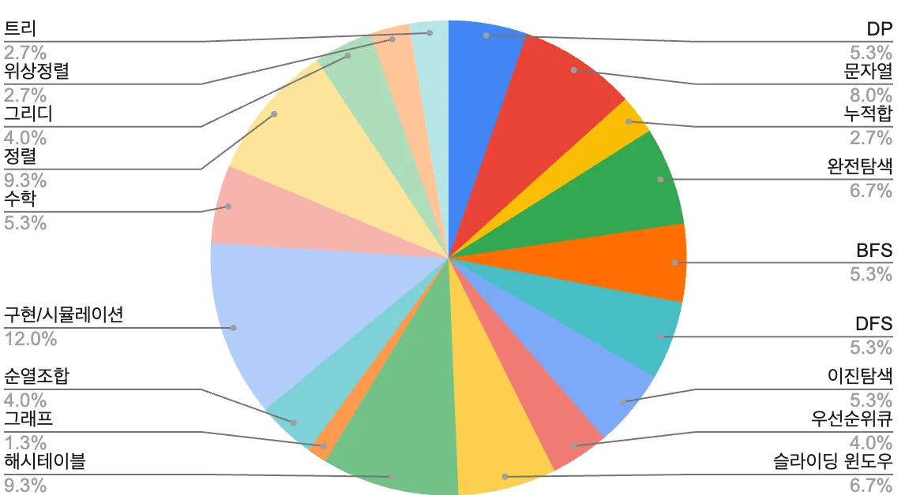

# 2024 코딩테스트 경향성 분석

(해당 내용은 https://www.nossi.dev/(노씨데브)의 제공 자료를 기반으로 하고 있습니다.)

 

## 출제경향 및 단기간 준비방법 (2024년 코테 기출 문제 50개에 대한 통계)

사실 순위를 분석하는게 의미 없을 정도로 고루 분포.

**면접**은 짧은 시간 내에 준비하면, 준비한 것 이상의 효과를 기대할 수 있다.   하지만 **코테**는 그렇지 않다. 준비를 해도 오히려 실력이 퇴화되는 경우까지도 존재.

보통의 경우 자료구조 알고리즘 학습도 잘 되어 있지 않아서 시간을 충분히 들여서 공부해야 한다.

그래도 당장 코딩 테스트가 있다면 어떻게 준비해야 하는가?

 

### 단기간의 준비 방법

- 복습, 정리의 관점에서 접근

- 숙달이 필요하고, 외워져 있어야 하는 내용들을 위주로 암기

- 문제는 시간을 재고 많이 풀어보되  
  1시간 ~ 2시간까지만 고민하고 풀지 못한다면, 답안 코드를 본 후 외우는 방식 취하기

- [다음은 Python을 기준으로 숙달되어야 하는 내용들을 담은 페이지](템플릿.md)

 

### 장기간의 준비 방법

- 문제 풀이 전, 자료구조와 알고리즘을 명확히 공부.

- 문제를 다양하고 깊이있게 생각하며 풀이.

- 책 추천: [심화]알고리즘 문제해결 전략 (종만북 저)

 

### 꿀팁

- JavaScript 같은 경우는 알고리즘에 친화적이지 않다. Python 사용을 추천.

- 사이트 추천: 프로그래머스 > 리트코드 > 백준 (삼성의 경우 백준이 우선)  
  백준은 문제를 선별하는 과정 자체가 까다로운 편.

 
 

## QnA

Q. 코딩테스트 언어 선택  
A. 시간이 좀 있다면 python을 기본으로 하되 다른 언어를 보조로 가져가는 형태가 최선.

Q. SQL 문제는 '프로그래머스 SQL 고득점 kit'만으로 충분히 대비가 될까요?  
A. 현재 단게에서는 기본적으로 대비가 되긴 함.

Q. 경력직 코테의 난이도는?  
A. 공채와 비슷하거나 조금 더 쉬운 경향이 있음.

Q. 최근 코딩테스트 난이도 상승 이유  
A. 구현 부분에서 난이도가 좀 올라가는 경향이 있긴 함.

 

### 문제 풀이 요령 & 공부 방법

Q. 시험당시에 바로 풀이가 생각 나지 않는 문제에 대한 접근  
A. 빠르게 훑기. 자신있는 문제 먼저 풀기.  
막히면 넘어가는 판단도 필요. 커트라인에 대한 감이 있다면 목표를 정정하는 것도 방법.

Q. 문제 접근법을 빠르게 아는 방법  
A. 하나의 문제에 대해 엄청나게 고민을 많이 해보는 시간이 필요.

Q. 금융권 코딩테스트 난이도 및 준비 방법  
A. 서비스 기업의 테스트 난이도보다는 확실히 쉬움.

Q. 요즘 트렌드에서 벗어난 문제도 준비해야 하는가?  
A. 기본만 충실하게 하려고 해도 풀어야 할 문제가 너무 많다.  
마지노선을 '다익스트라 알고리즘' 정도로 생각하면 된다. '위상정렬' 이상부터는 투머치.

Q. 양으로 박치기 하는 것에 대한 관점  
A. 새로운 문제를 해석하고 내 지식으로 응용할 수 있는 능력이 필요.  
기업 코테를 지원해서 풀어보는 것이 좋은 방법이 될 수 있다.

Q. 정규표현식을 알아야 하나요?  
A. 정규표현식을 반드시 알아야 하는 것은 아니다.  
정규표현식만으로 풀 수 있는 문제 같은 것은 없다.

Q. 기업별로 어느정도 맞춰야 합격 선인가요?  
A. ex) 7문제+n시간 => 3.5솔 / 3문제+2시간 => 2솔 / 2문제+3시간 => 2솔  
다만 요즘 커트라인이 올라가는 추세.

 
