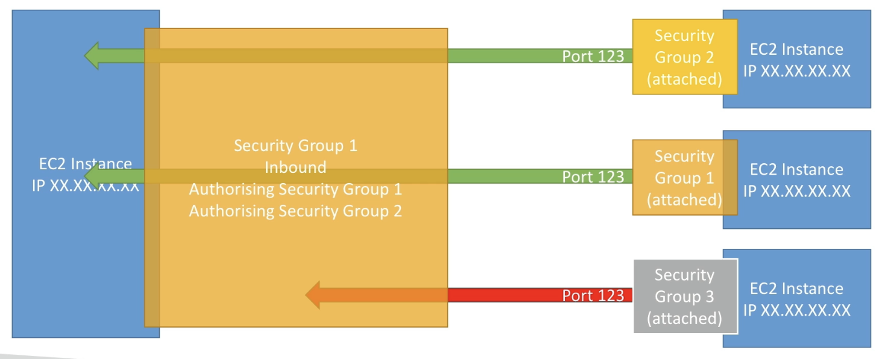
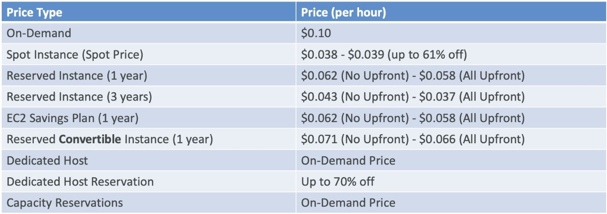

# Section 5. EC2 기초

## 목차

1. [EC2 개요](#1-ec2-개요)
2. [EC2 설정 옵션](#2-ec2-설정-옵션)
3. [EC2 User Data (부트스트랩)](#3-ec2-user-data-부트스트랩)
4. [EC2 인스턴스 타입](#4-ec2-인스턴스-타입)
5. [보안 그룹 (Security Groups)](#5-보안-그룹-security-groups)
6. [주요 포트 번호](#6-주요-포트-번호)
7. [SSH 접근 및 EC2 Instance Connect](#7-ssh-접근-및-ec2-instance-connect)
8. [EC2 구매 옵션](#8-ec2-구매-옵션)
9. [Spot Instance 심화](#9-spot-instance-심화)
10. [구매 옵션 비교 요약](#10-구매-옵션-비교-요약)

---

## 0. AWS 예산 설정

결제 콘솔의 우측 상단 > 결제 및 비용 관리(Billing and Management)

최초에는 관리자 액세스 권한이 있어도 결제 데이터에 액세스 할 수 없다.  
오로지 루트 계정으로 해결 가능.  
"IAM user and role access to Biling information" 활성화를 통해 결제 정보에 액세스하게 할 수 있다.

Butgents에서 예산의 한도와 예산 초과 상황에서의 알람을 설정할 수 있다.

---

## 1. EC2 개요

**EC2(Elastic Compute Cloud)** 는 AWS에서 가장 많이 사용되는 서비스 중 하나로, **IaaS(Infrastructure as a Service)** 형태의 가상 서버를 제공한다.  
사용자는 서버 컴퓨터를 임대해 운영체제와 프로그램을 설치해서 사용하는 형태.

**EC2가 제공하는 핵심 기능:**

| 기능                        | 서비스                      |
| --------------------------- | --------------------------- |
| 가상 머신 임대              | EC2 인스턴스                |
| 가상 드라이브에 데이터 저장 | EBS (Elastic Block Store)   |
| 머신 간 부하 분산           | ELB (Elastic Load Balancer) |
| 자동 스케일링               | ASG (Auto Scaling Group)    |

> 💡 **시험 포인트**: EC2는 단순히 가상 서버만이 아니라 EBS, ELB, ASG와 함께 묶이는 개념입니다. 클라우드 동작 원리를 이해하는 데 핵심이 되는 서비스입니다.

> 💡 **시험 포인트**
>
> | 서비스명                          | 기능                                                                 | 예시                      |
> | --------------------------------- | -------------------------------------------------------------------- | ------------------------- |
> | IaaS(Infrastructure as a Service) | 가상 서버를 빌려서 OS, 프로그램을 직접 관리                          | Amazon EC2                |
> | PaaS(Platform as a Service)       | 서버 환경의 구축 및 배포를 AWS가 많이 대신하며, 사용자는 코드에 집중 | AWS Elastic Beanstalk     |
> | SaaS(Software as a service)       | 이미 완성된 프로그램을 로그인해서 바로 사용                          | Gmail, Notion, Salesforce |

---

## 2. EC2 설정 옵션

EC2 인스턴스를 시작할 때 다음 항목들을 구성할 수 있다.

| 항목                    | 설명                                                                |
| ----------------------- | ------------------------------------------------------------------- |
| **운영체제 (OS)**       | Linux, Windows, Mac OS                                              |
| **CPU**                 | 코어 수, 컴퓨팅 파워                                                |
| **RAM**                 | 메모리 크기                                                         |
| **스토리지**            | 네트워크 연결형(EBS, EFS) 또는 하드웨어 직접 연결형(Instance Store) |
| **네트워크 카드**       | 네트워크 속도, 공인 IP 주소                                         |
| **방화벽 규칙**         | 보안 그룹(Security Group)                                           |
| **부트스트랩 스크립트** | EC2 User Data (최초 시작 시 실행)                                   |

---

## 3. EC2 User Data (부트스트랩)

**User Data** 는 인스턴스가 **처음 시작할 때 단 한 번** 자동으로 실행되는 스크립트다.

**주요 용도:**

- 소프트웨어 업데이트 설치
- 패키지/애플리케이션 설치
- 인터넷에서 파일 다운로드
- 웹 서버 초기 구성 등 부팅 작업 자동화

**예시 (Amazon Linux 기준):**

```bash
#!/bin/bash
yum update -y
yum install -y httpd
systemctl start httpd
systemctl enable httpd
echo "<h1>Hello from EC2 User Data</h1>" > /var/www/html/index.html
```

> 💡 **시험 포인트**:
>
> - User Data 스크립트는 **인스턴스 최초 시작 시 1회만** 실행됩니다 (재시작 시 재실행 안 됨)
> - User Data는 **root 권한**으로 실행됩니다 (sudo 불필요)

---

## 4. EC2 인스턴스 타입

https://aws.amazon.com/ko/ec2/instance-types/ 에서 최적화된 다양한 유형의 EC2 인스턴스를 확인 가능.

### 인스턴스 이름 체계

```
m5.2xlarge
││ └── 크기 (size within class)
│└──── 세대 (generation): 숫자가 높을수록 최신
└───── 인스턴스 클래스 (instance class)
```

### 인스턴스 타입 종류

**① 범용(General Purpose)**

- 균형 잡힌 컴퓨팅 / 메모리 / 네트워킹
- 적합한 워크로드: 웹 서버, 코드 저장소
- 예: `t2.micro`, `t3.medium`, `m5.large`

**② 컴퓨팅 최적화(Compute Optimized) — C 계열**

- 고성능 프로세서가 필요한 작업에 최적
- 적합한 워크로드:
  - 배치 처리
  - 미디어 트랜스코딩
  - 고성능 웹 서버
  - HPC(고성능 컴퓨팅)
  - 과학 모델링 / 머신러닝
  - 전용 게임 서버
- 예: `c5.large`, `c6g.xlarge`

**③ 메모리 최적화(Memory Optimized) — R, X, z 계열**

- 메모리 내 대용량 데이터 처리에 최적
- 적합한 워크로드:
  - 고성능 관계형/비관계형 DB
  - 분산 웹 캐시 (Memcached, Redis)
  - BI용 인메모리 DB
  - 비정형 빅데이터 실시간 처리
- 예: `r5.large`, `x1e.xlarge`

**④ 스토리지 최적화(Storage Optimized) — I, D, H 계열**

- 로컬 스토리지의 대용량 순차 읽기/쓰기에 최적
- 적합한 워크로드:
  - OLTP 시스템
  - 관계형/NoSQL DB
  - Redis 등 인메모리 DB 캐시
  - 데이터 웨어하우스
  - 분산 파일 시스템
- 예: `i3.large`, `d2.xlarge`

**인스턴스 타입 비교 예시:**

| 인스턴스    | vCPU | 메모리(GiB) | 스토리지       | 네트워크     |
| ----------- | ---- | ----------- | -------------- | ------------ |
| t2.micro    | 1    | 1           | EBS Only       | Low~Moderate |
| t2.xlarge   | 4    | 16          | EBS Only       | Moderate     |
| c5d.4xlarge | 16   | 32          | NVMe SSD 400GB | 10 Gbps      |
| r5.16xlarge | 64   | 512         | EBS Only       | 20 Gbps      |
| m5.8xlarge  | 32   | 128         | EBS Only       | 10 Gbps      |

> 💡 **시험 포인트**:
>
> - `t2.micro`는 AWS 프리 티어(Free Tier)에서 사용 가능한 인스턴스입니다
> - 인스턴스 타입을 암기하기보다는 **각 계열의 특징과 적합한 워크로드**를 이해하는 것이 중요합니다
> - 인스턴스 타입 비교는 [instances.vantage.sh](https://instances.vantage.sh) 에서 확인 가능합니다

---

## 5. 보안 그룹 (Security Groups)

**보안 그룹**은 AWS 네트워크 보안의 핵심으로, EC2 인스턴스에 들어오고 나가는 트래픽을 제어하는 **가상 방화벽**이다.  
EC2에서 동작하는 다른 애플리케이션과 다르게, EC2 외부에 존재한다.

### 기본 동작 방식

```
인터넷
  │
  ▼
[보안 그룹] ← 규칙에 따라 허용/차단
  │
  ▼
[EC2 인스턴스]
```

- **인바운드(Inbound)**: 외부 → EC2 방향 트래픽. **기본값: 전부 차단**
- **아웃바운드(Outbound)**: EC2 → 외부 방향 트래픽. **기본값: 전부 허용**

### 보안 그룹 규칙 구성 요소

보안 그룹 규칙은 다음 요소로 구성된다:

- **프로토콜**: TCP, UDP, ICMP 등
- **포트 범위**: 허용할 포트 (예: 80, 443, 22)
- **소스/대상 IP**: IPv4 또는 IPv6 CIDR 블록
- **참조 보안 그룹**: 특정 보안 그룹 ID를 소스로 지정 가능

### 중요 특성

- **여러 인스턴스에 연결** 가능 (1:N 관계)
- **리전/VPC 조합에 종속** — 다른 리전에서 사용 불가
- 보안 그룹은 EC2 **외부에서** 작동 — 차단된 트래픽은 인스턴스에 도달하지 않음
- SSH 접근용 보안 그룹을 **별도로** 분리해서 관리하는 것을 권장

### 보안 그룹 간 참조

보안 그룹은 IP 대신 **다른 보안 그룹을 소스로 참조**할 수 있다.



```
[보안 그룹 A가 연결된 EC2] → [보안 그룹 B가 허용한 인바운드 규칙] → [보안 그룹 B가 연결된 EC2]
```

이 방식은 IP가 바뀌어도 규칙이 자동 적용되므로 마이크로서비스 간 통신 제어에 유용하다.  
보다 자세한 사항은 '로드 밸런서'를 다룰 때 다시 설명한다.

> 💡 **시험 포인트**:
>
> - **타임아웃(Timeout)** 오류 → 보안 그룹 문제일 가능성이 높음 (트래픽이 차단됨)
> - **Connection Refused** 오류 → 애플리케이션 문제 또는 미실행 상태 (보안 그룹은 정상)
> - 인바운드는 기본 **차단**, 아웃바운드는 기본 **허용**
> - 보안 그룹은 **Stateful**: 인바운드 허용 시 해당 응답 트래픽은 자동으로 아웃바운드 허용

> 🍯 **꿀팁**:
>
> - EC2 인스턴스 접속 과정 내 타임아웃을 보게 된다면 100% EC2 보안그룹에서 발생하는 문제.

---

## 6. 주요 포트 번호

시험에서 자주 나오는 포트 번호를 반드시 암기해야 한다.

| 포트     | 프로토콜 | 용도                              |
| -------- | -------- | --------------------------------- |
| **22**   | SSH      | Linux 인스턴스 원격 접속          |
| **21**   | FTP      | 파일 업로드 (파일 공유)           |
| **22**   | SFTP     | SSH를 통한 파일 업로드 (보안 FTP) |
| **80**   | HTTP     | 비보안 웹사이트 접속              |
| **443**  | HTTPS    | 보안 웹사이트 접속                |
| **3389** | RDP      | Windows 인스턴스 원격 접속        |

> 💡 **시험 포인트**:
>
> - SSH(22)와 SFTP(22)는 **포트 번호가 동일**합니다
> - Windows 접속은 SSH가 아닌 **RDP(3389)** 를 사용합니다
> - Linux 접속: SSH(22) / Windows 접속: RDP(3389)

---

## 7. SSH 접근 및 EC2 Instance Connect

### SSH란

SSH(Secure Shell)은 로컬 PC에서 AWS 클라우드 가상 서버에 원격으로 안전하게 접속하여 제어할 수 있게 하는 보안 네트워크 프로토콜.  
Amazon Cloud를 다룰 때 SSH는 가장 중요한 기능으로써 동작한다.  
터미널이나 커맨드를 사용해서 원격 머신이나 서버를 제어할 수 있게 해주는 기능.

### SSH 접근 방법 (운영체제별)

| 환경             | 도구                                            |
| ---------------- | ----------------------------------------------- |
| Mac / Linux      | SSH 명령어 (`ssh -i keyfile.pem ec2-user@<IP>`) |
| Windows (구버전) | PuTTY                                           |
| Windows 10+      | SSH 명령어 (PowerShell/CMD에서 사용 가능)       |
| 모든 환경        | **EC2 Instance Connect** (브라우저 기반)        |

#### Linux 또는 Mac을 사용하여 SSH 실행 방법 (상세)

0. EC2 인스턴스 초기 생성 시 연결하는 Key Pair를 생성할 때 다운받은 개인키(`.pem`)파일을 준비한다.
1. 개인키 파일을 로컬 PC에 적절한 곳에 위치시킨다. (파일명 내 공백 제거)
2. `chmod 0400 {개인키 파일명}`을 통해 개인키 파일 모드를 변경한다.
3. 경로를 개인키 파일이 위치한 곳과 일치시킨다.
4. `ssh -i {개인키 파일명} ec2-user@{EC2 인스턴스 Public IP}` 입력
5. 머신 로그인 성공

Windows의 경우는 별도로 작성하지 않는다. (필요시 강의 참조)

### EC2 Instance Connect

- **브라우저에서 직접** EC2 인스턴스에 접속(SSH 세션을 실행)하는 방식
- 별도 키 파일 불필요 — AWS가 임시 키를 자동으로 업로드
- 기본적으로 **Amazon Linux 2** 에서만 즉시 사용 가능
- **포트 22는 반드시 열려 있어야** 동작함 (보안 그룹에서 22번 허용 필요)

#### EC2 Instance를 위한 IAM의 역할 및 사용

- EC2 인스턴스에 IAM API키를 입력하는 것은 최악 (다른 누군가가 회수 가능)
- EC2 Instance > Actions > Security > Modify IAM Role을 통해 IAM Role 지정 가능
- EC2 인스턴스에는 한 번에 하나의 Role만 연결할 수 있고, 인스턴스의 모든 애플리케이션이 그 Role과 권한을 공유
- 접속 유저의 IAM 권한이랑 충돌하는 경우가 발생하지 않음

> 💡 **시험 포인트**: EC2 Instance Connect도 내부적으로 포트 22(SSH)를 사용합니다. 보안 그룹에서 22번 포트가 닫혀 있으면 접속 불가.

---

## 8. EC2 구매 옵션

EC2 인스턴스는 사용 패턴과 비용 최적화 목적에 따라 다양한 구매 방식을 선택할 수 있다.

### ① On-Demand (온디맨드)

- **특징**: 사용한 만큼만 지불, 약정 없음
- **과금**: Linux/Windows → 초 단위, 기타 OS → 시간 단위 (첫 1분 이후)
- **비용**: 가장 높음, 선불 없음
- **적합한 경우**:
  - 단기간, 중단 없는 워크로드
  - 애플리케이션 동작 예측이 불가능한 경우
  - 처음 클라우드 이전 시

### ② Reserved Instances (예약 인스턴스)

- **특징**: 1년 또는 3년 약정, 최대 72% 할인
- **예약 항목**: 인스턴스 타입, 리전, 테넌시, OS를 지정
- **결제 방식**: 선불 없음 / 부분 선불 / 전액 선불 (선불 많을수록 할인 증가)
- **범위**: 리전 전체 또는 특정 가용 영역(AZ) 지정 가능
- **적합한 경우**: 안정적으로 장기 운영하는 워크로드 (DB 서버 등)
- Reserved Instance는 **마켓플레이스에서 사고팔 수 있음**

**Convertible Reserved Instance (전환형 예약 인스턴스)**

- 인스턴스 타입, 패밀리, OS, 범위, 테넌시를 자유롭게 변경 가능
- 할인율은 최대 66% (일반 RI보다 낮음)

### ③ Savings Plans (절감형 플랜)

- **특징**: 사용량 기준 약정 (예: 시간당 $10 사용 약정, 1~3년)
- **할인율**: 최대 72% (Reserved와 동일)
- 약정 초과 사용량은 On-Demand 가격 적용
- **특정 인스턴스 패밀리 + 리전에 고정** (예: us-east-1의 M5)
- **유연한 항목**: 인스턴스 크기, OS, 테넌시

### ④ Spot Instances (스팟 인스턴스)

- **특징**: 최대 90% 할인, 가장 저렴한 옵션
- **단점**: 내가 설정한 최대 가격보다 현재 스팟 가격이 높아지면 **인스턴스가 종료됨**
- **적합한 경우** (중단에 내성이 있는 워크로드):
  - 배치 처리
  - 데이터 분석
  - 이미지 처리
  - 유연한 시작/종료 시간이 가능한 작업
- **부적합한 경우**: DB, 중요 서비스 (갑자기 종료될 수 있음)

### ⑤ Dedicated Hosts (전용 호스트)

- **특징**: 물리 서버 전체를 나만 사용
- **용도**:
  - 라이선스 규정 준수 (BYOL — Bring Your Own License)
  - 소켓/코어/VM 단위 소프트웨어 라이선스 적용 필요 시
  - 강력한 규제/컴플라이언스 요구사항이 있는 기업
- **비용**: 가장 비싼 옵션
- **구매 방식**: On-Demand(초 단위) 또는 1~3년 예약

### ⑥ Dedicated Instances (전용 인스턴스)

- **특징**: 나만의 전용 하드웨어에서 실행되지만, **같은 계정의 다른 인스턴스와 하드웨어를 공유**할 수 있음
- 인스턴스 배치를 직접 제어할 수 없음 (Stop/Start 시 다른 하드웨어로 이동 가능)

**Dedicated Host vs Dedicated Instance 차이:**

| 구분                    | Dedicated Host | Dedicated Instance |
| ----------------------- | -------------- | ------------------ |
| 물리 서버 전체 점유     | ✅             | ❌                 |
| 소켓/코어 레벨 라이선스 | ✅ 가능        | ❌ 불가            |
| 인스턴스 배치 제어      | ✅ 가능        | ❌ 불가            |
| 타 계정과 하드웨어 공유 | ❌ 없음        | ❌ 없음            |
| 동일 계정 내 공유       | ❌ 없음        | ✅ 가능            |

### ⑦ Capacity Reservations (용량 예약)

- **특징**: 특정 AZ에 On-Demand 용량을 원하는 기간 동안 예약
- **약정 없음**: 언제든지 생성/취소 가능
- **할인 없음**: 사용 여부와 관계없이 On-Demand 요금 청구
- 할인 혜택을 원하면 Reserved Instance 또는 Savings Plans와 **함께 사용**
- **적합한 경우**: 특정 AZ에서 반드시 필요한 단기/중단 불가 워크로드

> 💡 **시험 포인트**:
>
> - **최대 할인**: Spot(90%) > Reserved/Savings Plan(72%) > Convertible RI(66%) > On-Demand
> - **Dedicated Host**: BYOL 라이선스나 컴플라이언스 요구사항이 있을 때 선택
> - **Capacity Reservations**: 할인 없이 용량만 확보. 할인이 필요하면 RI/Savings Plan 병행
> - **Reserved Instance**: 안정적으로 오래 쓰는 서비스 (DB 등)에 최적

---

## 9. Spot Instance 심화

### 스팟 인스턴스 동작 방식

1. 사용자가 **최대 허용 가격(Max Price)** 을 설정
2. 현재 스팟 가격 < 최대 허용 가격 → 인스턴스 실행 유지
3. 현재 스팟 가격 > 최대 허용 가격 → **2분 유예 후 인스턴스 중단/종료**

### 스팟 인스턴스 종료 절차

```
스팟 요청 취소 → 연결된 인스턴스 수동 종료
```

- 스팟 요청만 취소해도 인스턴스는 자동으로 종료되지 않음
- 반드시 **요청 취소 후 인스턴스를 직접 종료**해야 함

> 💡 **시험 포인트**: 스팟 요청을 취소하지 않고 인스턴스만 종료하면, 스팟 요청이 새 인스턴스를 다시 시작합니다.

### Spot Fleet (스팟 플릿)

**Spot Fleet** = Spot 인스턴스 + (선택) On-Demand 인스턴스의 집합

- 목표 용량과 최대 비용 내에서 자동으로 최적의 인스턴스를 선택
- **Launch Pool**: 인스턴스 타입, OS, AZ 조합을 여러 개 정의 가능

**스팟 할당 전략:**

| 전략                            | 설명                                  | 적합한 경우                |
| ------------------------------- | ------------------------------------- | -------------------------- |
| `lowestPrice`                   | 가장 저렴한 풀에서 실행               | 단기 비용 최적화           |
| `diversified`                   | 여러 풀에 분산 배치                   | 가용성 우선, 장기 워크로드 |
| `capacityOptimized`             | 용량이 충분한 풀 선택                 | 중단 최소화                |
| `priceCapacityOptimized` (권장) | 충분한 용량 풀 중 가장 저렴한 풀 선택 | 대부분의 워크로드에 최적   |

> 💡 **시험 포인트**: 스팟 플릿의 권장 전략은 `priceCapacityOptimized`입니다. 용량과 가격을 함께 고려하여 중단 위험을 낮추면서 비용을 최적화합니다.

---

## 10. 구매 옵션 비교 요약

### 비용 비교 (m4.large, us-east-1 기준)



| 구매 방식                 | 시간당 요금    | 비고             |
| ------------------------- | -------------- | ---------------- |
| On-Demand                 | $0.10          | 기준 가격        |
| Spot Instance             | $0.038~$0.039  | 최대 61% 절감    |
| Reserved (1년, 선불 없음) | $0.062         |                  |
| Reserved (1년, 전액 선불) | $0.058         |                  |
| Reserved (3년, 선불 없음) | $0.043         |                  |
| Reserved (3년, 전액 선불) | $0.037         |                  |
| Convertible RI (1년)      | $0.066~$0.071  | 일반 RI보다 비쌈 |
| Dedicated Host            | On-Demand 가격 |                  |
| Dedicated Host 예약       | 최대 70% 절감  |                  |
| Capacity Reservations     | On-Demand 가격 | 할인 없음        |

### 호텔 비유로 이해하기

| 구매 방식             | 비유                                                           |
| --------------------- | -------------------------------------------------------------- |
| On-Demand             | 호텔에 체크인 — 원할 때 오고, 원할 때 떠남. 풀 가격 지불       |
| Reserved              | 장기 투숙 — 미리 예약하면 할인                                 |
| Savings Plans         | 일정 금액을 미리 결제하고 원하는 방 타입 사용                  |
| Spot Instance         | 빈 방을 경매로 낙찰 — 호텔이 더 높은 가격 손님을 받으면 쫓겨남 |
| Dedicated Host        | 건물 전체를 전세 계약                                          |
| Capacity Reservations | 빈 방 보장 계약 — 쓰든 안 쓰든 요금 청구                       |

---

> **이전 섹션**: [Section 4. IAM 및 AWS CLI](section4.md)
> **다음 섹션**: [Section 6. EC2 - 솔루션스 아키텍트 어소시에이트 레벨](section6.md)
