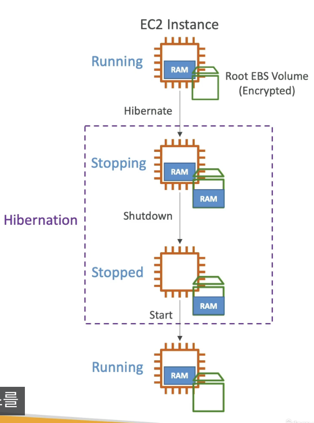

# Section 6. EC2 - 솔루션스 아키텍트 어소시에이트 레벨

## 목차

1. [Private IP vs Public IP vs Elastic IP](#1-private-ip-vs-public-ip-vs-elastic-ip)
2. [Elastic IP](#2-elastic-ip)
3. [Placement Groups (배치 그룹)](#3-placement-groups-배치-그룹)
4. [ENI (Elastic Network Interface)](#4-eni-elastic-network-interface)
5. [EC2 Hibernate (절전 모드)](#5-ec2-hibernate-절전-모드)

---

## 1. Private IP vs Public IP vs Elastic IP

### IPv4 주소 개념

EC2 인스턴스는 **두 가지 IP 주소**를 동시에 가질 수 있다.

| 구분             | Public IP            | Private IP                   |
| ---------------- | -------------------- | ---------------------------- |
| 접근 범위        | 인터넷(WWW) 전체     | 사설 네트워크 내부만         |
| 고유성           | 인터넷 전체에서 유일 | 동일 사설망 내에서 유일      |
| 지리 위치        | 쉽게 추적 가능       | 추적 불가                    |
| 복수 망 중복     | 불가                 | 다른 회사 망과 중복 가능     |
| 인터넷 연결 방법 | 직접                 | NAT + 인터넷 게이트웨이 경유 |

**Private IP 대역 (RFC 1918):**

```plain
10.0.0.0/8        (10.0.0.0 ~ 10.255.255.255)
172.16.0.0/12     (172.16.0.0 ~ 172.31.255.255)
192.168.0.0/16    (192.168.0.0 ~ 192.168.255.255)
```

### AWS EC2에서의 IP 동작

- EC2 인스턴스 생성 시 기본으로 **private IP + public IP** 모두 할당  
   ⚠️ public IP는 항상 자동 할당되는 건 아님 (서브넷/인스턴스 생성 설정에 따라 할당 가능)
- SSH 접속 시 기본적으로는 **public IP만** 사용 가능 (외부에서 같은 VPC가 아니므로 private IP로 바로 접근 불가)  
   ⚠️ VPC(Virtual Private Cloud): 독립된 가상 네트워크 공간
- 인스턴스를 중지(stop) 후 재시작(start)하면 public IP가 변경됨  
   ⚠️ Elastic IP를 통해 Public IPv4 주소를 고정 가능 (비권장)

---

## 2. Elastic IP

**Elastic IP**는 고정된 public IPv4 주소로, 인스턴스를 중지/재시작해도 IP가 변하지 않는다.

### 특징

- 명시적으로 삭제하지 않는 한 **영구적으로 소유**
- 한 번에 **하나의 인스턴스에만** 연결 가능
- 계정당 기본 **5개**까지 생성 가능 (AWS에 증설 요청 가능)
- 인스턴스나 ENI에 장애 발생 시 다른 인스턴스로 **빠르게 리매핑**하여 장애 마스킹 가능

### AWS 권고사항

> **Elastic IP 사용을 가급적 지양할 것**  
> Elastic IP는 종종 좋지 않은 아키텍처 결정의 신호다.  
> 대신 아래 방법을 권장한다:
>
> - Random public IP + DNS 이름 등록
> - Load Balancer 사용 (public IP 불필요): AWS에서 취할 수 있는 최상의 패턴

> 💡 **시험 포인트**:
>
> - Elastic IP = 고정 public IPv4 주소
> - 계정당 기본 5개 제한
> - 사용하지 않을 때도 **요금이 부과됨** (연결되지 않은 Elastic IP에 과금)
> - 아키텍처적으로는 ELB + DNS 조합이 더 권장됨

---

## 3. Placement Groups (배치 그룹)

EC2 인스턴스의 **물리적 배치 전략**을 직접 제어하고 싶을 때 사용한다.  
3가지 전략 중 하나를 선택하여 배치 그룹을 생성한다.

### 3종 전략 비교

| 구분             | Cluster                 | Spread                  | Partition                             |
| ---------------- | ----------------------- | ----------------------- | ------------------------------------- |
| 배치 방식        | 동일 AZ, 동일 랙        | 서로 다른 물리 하드웨어 | 파티션별 별도 랙 세트                 |
| AZ               | 단일 AZ                 | 다중 AZ 가능            | 다중 AZ 가능                          |
| 인스턴스 수 제한 | 없음                    | **AZ당 7개**            | **AZ당 7개 파티션**, 수백 개 인스턴스 |
| 장점             | 초고속 네트워크(10Gbps) | 동시 장애 위험 최소화   | 대규모 분산 + 파티션 격리             |
| 단점             | AZ 장애 시 전체 다운    | 인스턴스 수 제한        | 상대적으로 복잡한 관리                |
| 주요 용도        | Big Data, 초저지연 앱   | 고가용성 크리티컬 앱    | Hadoop, Cassandra, Kafka              |

### Cluster (클러스터)

```
┌─────────────────────────── Same AZ ───────────────────────────┐
│   [EC2] ─── [EC2] ─── [EC2]                                   │
│     │  ╲   ╱  │  ╲   ╱  │   ← 10 Gbps 네트워크              │
│   [EC2] ─── [EC2] ─── [EC2]                                   │
└───────────────────────────────────────────────────────────────┘
```

- **장점**: Enhanced Networking 사용 시 인스턴스 간 **10Gbps** 대역폭
- **단점**: AZ 장애 시 **모든 인스턴스 동시 장애**
- **용도**: 빠르게 완료되어야 하는 Big Data 작업, 초저지연·고처리량 애플리케이션

### Spread (분산)

```
┌── AZ 1 ──┐  ┌── AZ 2 ──┐  ┌── AZ 3 ──┐
│ HW1      │  │ HW3      │  │ HW5      │
│ [EC2]    │  │ [EC2]    │  │ [EC2]    │
│ HW2      │  │ HW4      │  │ HW6      │
│ [EC2]    │  │ [EC2]    │  │ [EC2]    │
└──────────┘  └──────────┘  └──────────┘
```

- **장점**: 각 인스턴스가 다른 물리 하드웨어 → 동시 장애 위험 감소, AZ 분산 가능
- **단점**: **AZ당 최대 7개** 인스턴스 제한
- **용도**: 가용성 최대화, 각 인스턴스가 독립적으로 장애 격리되어야 하는 크리티컬 앱

### Partition (파티션)

```
┌──────── us-east-1a ─────────┐  ┌── us-east-1b ──┐
│  Partition 1 │  Partition 2 │  │   Partition 3  │
│  [EC2][EC2]  │  [EC2][EC2]  │  │   [EC2][EC2]   │
│  [EC2][EC2]  │  [EC2][EC2]  │  │   [EC2][EC2]   │
└──────────────┴──────────────┘  └────────────────┘
```

- AZ당 최대 **7개 파티션**, 리전 내 여러 AZ에 걸쳐 배포 가능
- 파티션 간 **랙(rack) 공유 없음** → 파티션 장애가 다른 파티션에 미치지 않음
- 수백 개 EC2 인스턴스 운영 가능
- 인스턴스가 **자신의 파티션 정보를 메타데이터로 접근** 가능 → 파티션 인식 앱에 활용
- **용도**: HDFS, HBase, Cassandra, Kafka 등 대규모 분산 시스템

> 💡 **시험 포인트**:
>
> - **Cluster**: 성능 최우선, 단일 AZ, 장애 위험 높음
> - **Spread**: 가용성 최우선, AZ당 7개 제한
> - **Partition**: 대규모 분산 시스템, 파티션 단위 장애 격리
> - Spread는 AZ당 **7개 인스턴스** 제한, Partition은 AZ당 **7개 파티션** (파티션당 수십 개 인스턴스 가능)

---

## 4. ENI (Elastic Network Interface)

**ENI**는 VPC 내에서 **가상 네트워크 카드**를 나타내는 논리적 컴포넌트다.  
EC2에 기본으로 하나(eth0) 부착되며, 추가 ENI를 독립적으로 생성하여 부착할 수 있다.

외부에서 보는 네트워크 신분증 묶음으로 보면 된다.

해당 내용은 AWS에서도 심화 개념으로 숙달하는 데 시간이 걸릴 수 있다.  
[ENI관련 블로그 글](https://aws.amazon.com/ko/blogs/aws/new-elastic-network-interfaces-in-the-virtual-private-cloud/)을 참고.

### ENI 속성

각 ENI는 다음 속성을 가질 수 있다:

| 속성                   | 설명                              |
| ---------------------- | --------------------------------- |
| Primary Private IPv4   | 하나의 주 사설 IP                 |
| Secondary Private IPv4 | 하나 이상의 보조 사설 IP          |
| Elastic IP             | private IPv4 당 하나의 Elastic IP |
| Public IPv4            | 하나의 공인 IP                    |
| Security Groups        | 하나 이상의 보안 그룹             |
| MAC Address            | 하드웨어 주소                     |

### ENI의 핵심 특성

- **독립적으로 생성** 가능하며, EC2에 동적으로 부착/탈착 가능
- **다른 EC2로 이동(move)** 가능 → 장애 조치(failover)에 활용
- **AZ에 종속됨** (Availability Zone-bound): 생성된 AZ를 벗어나 이동 불가
- 인스턴스와 함께 생성된 ENI는 인스턴스 종료에서 제거되지만, 직접 생성한 ENI는 제거되지 않음

### failover 활용 예시

```
평상시:
  EC2-A (eth0: primary ENI)
        (eth1: secondary ENI 192.168.0.42)

장애 발생:
  EC2-A 장애 → secondary ENI를 EC2-B로 이동

장애 이후:
  EC2-B (eth0: primary ENI)
        (eth1: secondary ENI 192.168.0.42)  ← 동일 IP 유지
```

secondary ENI를 다른 인스턴스로 이동하면 동일한 IP 주소를 유지한 채 트래픽을 전환할 수 있다.

#### failover 한계

ENI만 옮긴다고 앱 데이터나 실행 상태까지 옮겨지지는 않는다.  
DB, 세션, 업로드 파일 등이 기존 로컬 디스크에만 있으면 장애조치가 깨질 수 있음.

현대적인 웹 서비스의 일반적인 고가용성 정답은 보통 ENI 이동이 아니라 ALB + 여러 AZ의 EC2 Auto Scaling Group.

Primary ENI는 분리할 수 없다.  
다른 EC2로 옮겨 장애조치에 쓰는 건 보통 secondary ENI다.

> 💡 **시험 포인트**:
>
> - ENI = 가상 네트워크 카드, VPC 내 논리적 구성요소
> - ENI는 **AZ에 바인딩**됨 → 다른 AZ로 이동 불가
> - 독립적으로 생성 후 인스턴스에 동적 부착 가능 → 장애 조치(failover)에 활용
> - secondary ENI를 다른 인스턴스로 옮겨 IP 주소를 유지하는 패턴

---

## 5. EC2 Hibernate (절전 모드)

### 인스턴스 상태별 동작 이해

| 상태          | 동작                                          |
| ------------- | --------------------------------------------- |
| **Stop**      | EBS의 데이터 유지, 다음 시작 시 그대로 재개   |
| **Terminate** | root EBS 볼륨(설정에 따라) 삭제 → 데이터 손실 |
| **Hibernate** | RAM 상태를 암호화된 root EBS에 저장 후 중지   |

### EC2 Hibernate란?

인스턴스를 **절전(hibernate)** 상태로 전환하면:

1. **RAM의 내용**이 암호화된 root EBS 볼륨에 기록됨 (RAM은 제거)
2. 인스턴스가 중지됨
3. 재시작 시 EBS에서 RAM을 복원 → **OS 부팅 없이 즉시 이전 상태로 복귀**



```plain
[Running]
   │ RAM ←→ Root EBS (Encrypted)
   │
   ↓ hibernate
[Stopping] → RAM 덤프 → EBS에 저장
   │
   ↓
[Stopped] → EBS에 RAM 상태 보관 중
   │
   ↓ start
[Running] → EBS에서 RAM 복원 → 즉시 이전 상태 재개
```

### Hibernate의 장점

- **빠른 부팅**: OS 재시작 없음, 애플리케이션 캐시 워밍 불필요
- **상태 보존**: 장시간 실행 프로세스 중단 없이 일시 정지 가능

### 사용 요건 (제약사항)

| 항목                 | 조건                                                     |
| -------------------- | -------------------------------------------------------- |
| 지원 인스턴스 패밀리 | C3, C4, C5, I3, M3, M4, R3, R4, T2, T3 등                |
| RAM 크기             | **150GB 미만**                                           |
| 인스턴스 크기        | Bare metal 인스턴스 불가                                 |
| AMI                  | Amazon Linux 2, Linux AMI, Ubuntu, RHEL, CentOS, Windows |
| Root Volume          | **암호화된 EBS** 필수 (Instance Store 불가)              |
| 구매 옵션            | On-Demand, Reserved, Spot                                |
| 최대 기간            | **60일** 초과 불가                                       |

### 주요 사용 사례

- 장시간 실행 처리 작업 (중단 없이 일시 정지 필요)
- RAM 상태 저장 (초기화 비용이 큰 서비스)
- 초기화에 오랜 시간이 걸리는 서비스

> 💡 **시험 포인트**:
>
> - Hibernate = **RAM 상태 보존** + 빠른 재시작
> - Root EBS 볼륨은 **반드시 암호화** 되어야 함
> - RAM 크기 **150GB** 이하 제한
> - **60일** 초과 hibernate 불가
> - Stop/Terminate와 Hibernate의 차이를 명확히 구분할 것

---

## 정리 요약

| 개념                        | 핵심 내용                                             |
| --------------------------- | ----------------------------------------------------- |
| Private IP                  | 사설망 내부 식별, 인스턴스 수명 동안 고정             |
| Public IP                   | 인터넷 식별, stop/start 시 변경됨                     |
| Elastic IP                  | 고정 public IPv4, 계정당 5개 기본, 미사용 시에도 과금 |
| Placement Group - Cluster   | 단일 AZ, 초고속 네트워크, 동시 장애 위험              |
| Placement Group - Spread    | 다중 AZ, AZ당 7개 제한, 장애 격리                     |
| Placement Group - Partition | 대규모 분산 시스템, AZ당 7파티션, 파티션 간 랙 분리   |
| ENI                         | 가상 네트워크 카드, AZ 바인딩, failover 활용          |
| EC2 Hibernate               | RAM → EBS 저장, 60일 제한, 암호화 EBS 필수            |

---

> **이전 섹션**: [Section 5. EC2 기초](section5.md)  
> **다음 섹션**: [Section 7. EC2 인스턴스 스토리지](section7.md)
