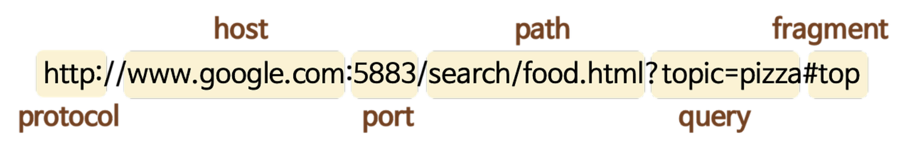

# 웹의 시작 - HTTP의 탄생과 기초를 쉽게 이해하는 시간

## 예시 구현

### 단일 파일

웹 기술의 가장 핵심은 Browser. <br/>
잘 알다시피, 브라우저가 항상 웹 페이지를 가지고 있는 것은 아님. <br/>
Web Server에서 .js와 같은 파일을 가져와서 client에게 보여줌.

많은 네트워크 기술이 있지만, 웹 개발자가 가장 많이 다루는 HTTP 통신에 대한 이야기.

HTTP(my-server.js)로 강의를 전달하기 위해 코드를 작성한다는 상황에서의 수업 진행.

> my-server.js

```javascript
// 노드 http 모듈로 웹서버 생성
const http = requrie("http");

// 서버가 제공할 강의
const content = `HTTP Lecture`;

// 요청을 처리할 핸들러 함수
const handler = (req, res) => res.end(content);

// 핸들러로 http 서버 객체를 하나 생성
const server = http.createServer(handler);

// 서버는 3000번 포트에서 요청을 기다림
server.listen(3000, () => console.log("server is running ::3000"));
```
```
$ node my-server.js
> server is runing ::3000
```

<br/>

server뿐 아니라 강의를 전용 클라이언트(my-client.js) 생성도 진행.

> my-client.js

```javascript
// http 요청을 만들기 위해 http 모듈을 사용
const http = require("http");

// 응답 핸들러를 생성
const handler = (res) => {
    const data = [];

    // 응답이 오면 data에 기록.
    res.on("data", chunk => data.push(chunk.toString()));
}

// 강의 서버 주소 http://localhost:3000으로 접속하는 url 객체 준비
const options = new URL("http://localhost:3000/");

// http 모듈의 request 함수로 서버에 요청을 보내는 request 객체를 구성
const req = http.request(options, handler);

// 서버에 요청을 보냄
req.end();
```

```
$ node my-client.js
> HTTP Lecture
```

<br/>

### 더 많은 수업 자료를 여러 페이지로 제공하기 위해서는 파일 형태로 분리

> my-server.js 일부 수정

```javascript
// 요청한 파일을 웅답하는 함수
const statc = (req, res) => {
    // 요청한 파일의 경로를 계산
    const filepath = path.join(__dirname, "public", req.url);

    // 요청한 파일 읽기
    fs.readFile(filepath, (err, data) => {
        // 파일 읽기 실패 
        // 상황 1.클라이언트에서 서버에 존재하지 않는 파일을 요청
        // 상황 2.서버가 자원 부족등의 문제로 파일을 읽지 못하는 경우
        if (err) return res.end("Not Found");

        // 파일을 읽고 내용을 응답
        res.end(data);
    })
}

// static 함수를 요청을 처리할 핸들러 함수에 적용
const handler = (req, res) => static(req, res);
```

<br/>

> my-client.js 일부 수정

클라이언트 요청에서 파일명까지 필요한 구조로 수정이 필요. <br/>
(ex: http://localhost:3000/ch01.txt)

node의 전역 객체 중, process의 argv에는 노드 프로그램 실행할 때 입력한 명령어들이 담겨있음.

```javascript
// 명령어 인자로 받은 url
const url = process.argv[2]

// url 인자가 없으면 오류를 출력하고 종료 (방어처리)
if (!url) {
    console.error("Usage: node my-client.js <url>");
    process.exit();
}

// 인자로 접속하는 url 객체를 준비
const options = new URL(url);

// ...
```

```
$ node my-client
> Usage: node my-client/index.js <url>

$ node my-client http://localhost:3000/ch01.txt
> HTTP Lecture

$ node my-client http://localhost:3000/ch02.txt
> HTTP Lecture 2

$ node my-client http://localhost:3000/ch03.txt
> Not Found
```

여기까지 HTTP 0.9를 설명하기 위한 간단한 예제.

<br/>
<br/>

## 역사

### 시초

'버너스 리' 1989년도에 인터넷 상에서 문서를 받을 수 있는 구조를 최초로 제안. <br/>
4가지 핵심요소를 제안했는데, 

#### - HTML

Hyper Text Markup Language <br/>
텍스트 이상의(스타일 시트, 링크 등을 포함) 것들을 작성할 수있는 markdown 언어.

my-server.js에서 만든 txt파일이 HTML 문법으로 다시 대체될 수 있음.

#### - HTTP

앞서 설명한 HTML을 전송하기 위한 통신 규약. <br/>
보다 위에서 언급한 코드 예시 중의, `const http = reuqire("http");`가 해당.

#### - httpd

웹 서버의 백그라운드에서 실행되어, 들어오는 서버 요청을 대기하는 데몬(Daemon) 프로그램.

my-server.js 자체가 그 역할을 해준 것.

#### - WWW(WorldWidwWeb)

클라이언트쪽을 나타냄. <br/>
우리가 현재 사용하는 웹 브라우저의 모태라고 할 수 있음.

my-client.js가 브라우저 역할을 수행했음으로 이해하면 된다.

<br/>

### 연혁

#### HTTP/0.9 (1991)

90년도에 HTTP/0.9 프로토콜 완성. <br/>
91년도에 외부에 공개.

#### HTTP/1.0 (1996)

표준문서를 관리하는 IETF 단체의 HTTP 작업 그룹이 만들어지고, RFC 정식문서로써 HTTP/1.0이 공개됨.

주요 변경사항은 메서드(GET, POST)가 추가되었다는 것. <br/>
Header와 Body 개념도 도입됨.

헤더에는 캐싱과 관련된 내용들이 대표로 담김.

#### HTTP/1.1 (1997)

PUT, DELETE, PATCH, etc.. 우리가 현대에 아는 모든 메서드 추가. <br/>
cache를 전문적으로 다루기 위해 cache-control 헤더가 추가됨.

성능과 관련하여 <br/>
서버와 클라이언트가 연결을 위한 과정에서 TCP 3-way hand shkae를 통해 연결을 하고 그 위에서 동작하는 과정 내, <br/>
한 번 연결되면 계속 주고받을 수 있도록 돕는 keep-alive 응답 헤더도 추가됨.

#### HTTP/2.0 (2015)

google의 spdy라는 프로토콜을 기반으로 만든 규약. <br/>

헤더가 다양해져서 길이가 길어졌는데 이를 압축할 수 있고, 메시지를 보내는 단위도 string 단위로 보낼 수 있음.

#### HTTP/3.0 (2022)

오랜 기간동안 HTTP의 버전 업데이트가 이루어졌는데, <br/>
기본이 항상 유지되는 핵심 요소는 다음과 같음.

> URL

URL 구성 요소


> Header(data의 meta정보)

> Body(data)

> StatusCode(값에 따라서 브라우저가 처리할 방법을 정의)
