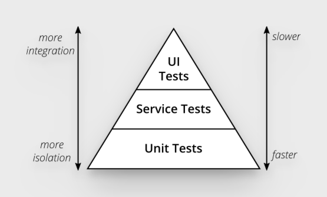

# 스토리북, 테스트와 함께 하는 컴포넌트 주도 프론트엔드 개발

## 프론트엔드의 문제와 고민들

TypeScript를 써도 QA단계에서 에러가 엄청 나온다.  
QA과정에서 기획의 오해와 누락을 알게된다.

경우의 수가 많아질 수록 재현도 어렵고, 파악도 어렵다.  
공통 로직이나 디자인 시스템을 건드리면 옛날 동작하던 기능도 멈추고는 한다.

 

### 믿을만한 테스트와 함께라면?

- 디자인이 없어도 로직 먼저 개발 가능
- 데이터 타입을 넘어 런타임 동작을 검증
- 사용자 입장에서 케이스와 시나리오 정의
- 에러를 조기에 발견하고 선순환을 만들기
- 복잡한 경우의 수도 쉽게 재현
- 공통 로직도 자신있게 리팩토링

보통 **테스트**를 생각할 때 자동화 테스트 코드의 작성부터 떠올리지만, PR에 test case부터 적는 것부터가 시작.

 
 

## 프론트 TDD의 현실과 한계

### 테스트에 대한 고충

- 테스트할 시간의 부족
- 프론트 테스트 관련 정보가 없음
- 모킹을 어디가지 해야 하는가?
- 신뢰성이 낮음
- 테스트가 너무 오래 걸리고 느림

 

### 문제를 뒤집어 생각

- 개발 속도를 올려줄 수 있는 테스트
- 사용자 입장에서 직관적인 테스트
- 최소한으로 모킹하고 실제 환경과 유사한 테스트
- 웹 표준과 접근성에 기반해서 신뢰할 수 있는 테스트
- 많은 경우의 수를 빠르게 검증할 수 있는 테스트

**장기적으로 언젠가 도움되는 코드가 아닌, 지금 당장 도움이 되는 테스트** 작성이 필요.

 
 

## 컴포넌트 주도 개발

### 테스트에 대한 기본 지식

- E2E

  프로덕션과 최대한 동일한 환경에서 실제 백엔드 API로 사용자 동작과 흐름의 전 과정을 테스트  
  ex) playwright, cypress, nightwatch 등

- Integration

  프론트엔드에서는 주로 컴포넌트를 통해 렌더링하고 클릭, 입력 등의 상호작용을 통해 상태 검증  
  ex) vitest + @testing-library 등

- Unit

  순수함수나 API, 클래스 구현체 등의 입출력을 검증  
  React의 테스트 러너가 대부분 지원

 

### E2E의 장점과 한계

#### 장점

- 실제 브라우저로 크로스 브라우저 테스트 가능
- 클릭하고 입력하고 등등 사용자 입장에서 직관적
- 기존의 사람들이 직접 손으로 하던 방식을 코드화 한 것

#### 단점

- 15분 넘게 걸리는 깃허브 액션을 누구도 좋아하지 않음
- 개발 중 누구도 돌려보지 않고, 쉽게 깨짐
- 모든 페이지의 의존성이 뒤섞여서 상태도 많고 까다로움

속도만 문제인 것은 아님.  
서로 다른 컴포넌트의 경계를 침범하고, 강결합을 유도함.  
API, 라우팅, 시간 등 수많은 상태와 의존성의 지옥.  
까다롭고 침투적인 모킹 방식을 요구함. (jest.mock)  

 

### Unit test와 테스트 피라미드

- 전통적으로 Unit을 장려해옴
- 순수함수나 plain 객체로 로직을 짜면 테스트하기 쉬움
- 속도도 매우 빠름

하지만 바야흐로 프론트엔드의 시대.  
프론트엔드는 백엔드에서 독립되었고, 프론트의 복잡성은 의존성의 통합에서 오는 경우가 대부분.

유닛 테스트 로직이 프론트에 없지는 않지만 보통 백엔드에서 처리.  
옛날처럼 view model을 나눠도 이미 없는 테스트가 되고는 한다.

임의의 아키텍쳐를 적용하려고 하면 이상하다.  
(React는 애초에 MVC, MVVM 등을 버리고 나온 프레임워크이기 때문)

###

리액트와 같은 모던 프론트엔드 프레임워크는 **합성 가능한 컴포넌트**를 강조.  
따라서, **통합 테스트 = 컴포넌트 테스트**

 

### 컴포넌트 테스트로 가는 길

E2E와 Unit의 장점을 모아서

- 여러 의존성의 통합을 볼 수 있고
- 사용자 입장에서 직관적이고

 

- 빠르게 실행되고
- 복잡성을 작은 단위로 쪼갤 수 있고
- 의존성 주입과 경우의 수 재현이 더 쉽고

 
 

## 스토리북 미신 부수기

### 스토리북을 뭐라고 생각하고 있는가?

예쁜 공용 컴포넌트 도감?  
특정 회사의 느리고 무거운 오픈소스 제품?

 

### 리액트 공식 문서가 말하는 스토리북

많은 시작적 state를 한 번에 보여주기.

컴포넌트가 많은 시각적 state를 가지고 있다면, 한 페이지에서 모두 보여주는 게 편할 때가 있다. 
이런 페이지는 자주 'living styleguie'혹은 'storybook'이라고 부른다.

그래서 스토리북으로 할 수 있는 일들은...

- 다양한 컴포넌트의 상태를 한 눈에 볼 수 있게 함
- 다양한 경우의 수를 쉽게 재현 가능
- 컴포넌트를 페이지에서 독자적으로 렌더
- 데브툴이나 플레이그라운드로도 사용할 수 있음

그저 컴포넌트를 렌더한 페이지만 존재하면 된다.  
특정 회사의 제품과는 무관.

 

- 자연스럽게 컴포넌트 사이의 경계가 명확하게 된다
- 복잡한 모킹이 필요없다
- 디버깅에 시간을 낭비하지 않고, 구현에 집중할 수 있다

 
 

## UI 테스트 베스트 프랙티스

### 웹표준 접근성 Role, 접근가능한 이름의 사용

**프론트엔드 테스트 작성을 잘 하려면, 웹표준 접근성을 잘 알아야 한다.**  
❌ xpath, css, data-test-id, 등등

CSS-in-JS의 사용에서 해쉬때문에 class name과 관련한 문제가 발생하고  
data-test-id 같은 보조 수단을 사용하려고 하게 되는데, 이는 일을 두번하게 되는 것.

✅ getByRole('button', {name: '구매하기'})

 

### 비동기 web first assertion을 사용

"당신은 당신도 추측할 수 없는 이유로 sleep(500)을 넣지 않으면 가끔 통과되지 않는 테스트를 만날 것이다"  
❌ waitForTimeout, sleep

flaky한 걸 고치느라 스트레스..  
너무 길게 잡으면 테스트가 느려져서 스트레스를 받게될 것.

 

### 의존성과 결합도에 대해 잘 생각

✅ "겨우 코드 3줄 테스트하려고 모킹만 수십 줄"  

- 의존성 설계를 잘 해야하는 것을 몸의 고생을 통한 해결
- 여러분과 동료 모두가 테스트를 싫어하고 증오하게 만듦

❌ 실제 의존성, 가짜 구현체 주입, 실용적인 모킹  

- jsdom 대신 vitest browser mode를 사용 (발표자 개인적 의견)
- useQuery를 모킹하는 대신 그저 prop으로 데이터를 넘기기
- 개인적으로 vi.mock, vi.fn, vi.spyOn은 한 줄도 쓰지 않음

 
 

## Q&A

Q. 팀에 테스트를 어떻게 도입하면 좋을까요?

A. 수동 테스트를 잘 하는 것부터 시작하면 좋음.  
PR에 테스트 케이스와 데이터, 방법을 올리게 할 것.  
스토리북을 만들어보고 플레이그라운드를 만들기.  
수동 테스트가 익숙해지면 하나씩 자동화 코드로 옮겨보기.

 

Q. 서버 컴포넌트나 SSR 테스트는?

A. 넷플릭스의 SafeTest처럼 앱과 동일하게 앱 내부에서 컴포넌트를 렌더하고 테스트하는 도구를 쓰세요.

 

Q. 스타일은 테스트 하나요?

A. 현재로써는 스냅샷이 최선이지만, AI가 길을 열어줄 것으로 보고 있음.

 

Q. 디자인 시스템 하나요?

A. 큰 조직에서만 디자인 시스템이 필요하다는 말에 휘둘리지 말 것.  
무리하게 욕심내지말고 필요한 만큼만 전문가들이 만든 헤드리스 컴포넌트부터 시작.

공용 컴포넌트를 다양한 유즈케이스에 맞게 꼼꼼히 테스트한다면  
모든 페이지에서 테스트를 해야하는 부담이 크게 줄어듦.

 

Q. 프론트엔드에서 TDD 하시나요?

A. 오늘 설명처럼 테스트 먼저 짜는 것은 대단한 기술이 아니다.  
인간의 말로 쓴 시나리오를 조금씩 테스트로 옮기고, 구현하면 된다.

자동화하기 어려울 때, 손으로 TDD해도 됨.  
스토리북으로 플레이그라운드를 만들 것!

 

Q. 테스트나 설계를 배우기 위한 책이나 자료를 추천해주세요

A. 아래의 책 추천

- 프런트엔드 개발을 위한 테스트 입문 (추천)
- 지식 제로부터 배우는 소프트웨어 테스트
- 테스트 주도 개발 (추천)
- 단위 테스트: 생산성과 품질을 위한 단위 테스트 원칙과 패턴
- 테스트 주도 개발로 배우는 객체 지향 설계와 실천

강의가 별도로 존재하긴 합니다.

 
 
