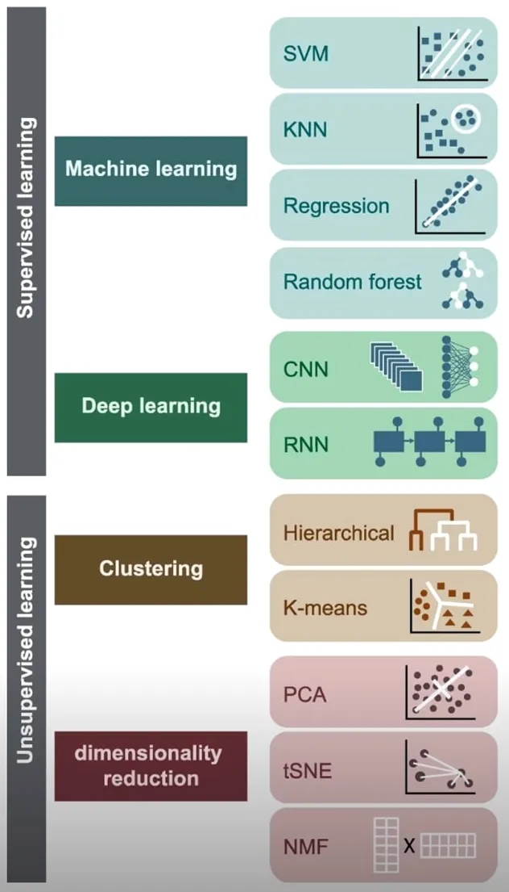
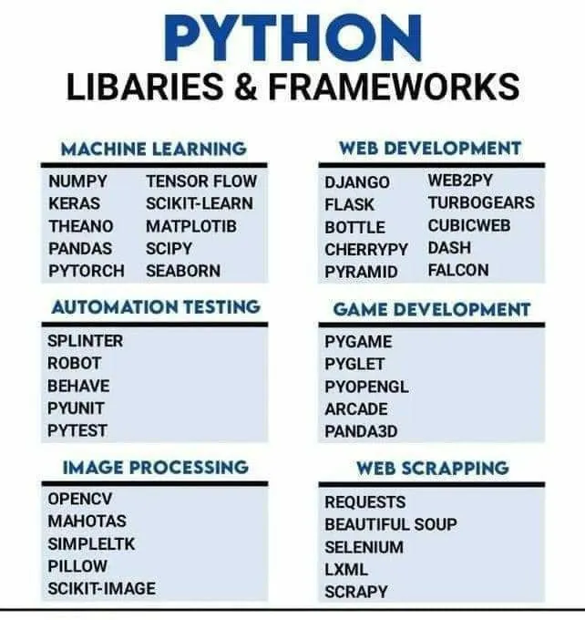
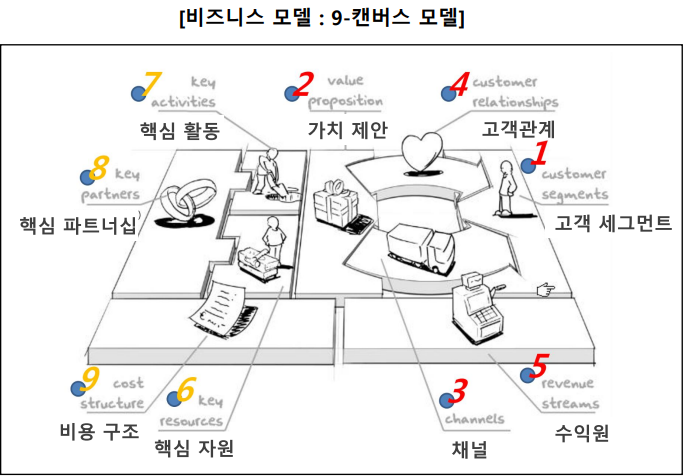
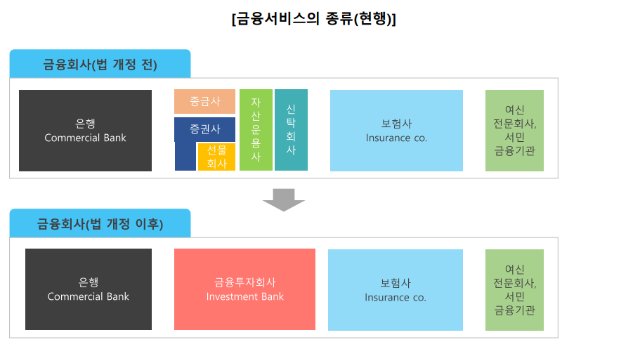
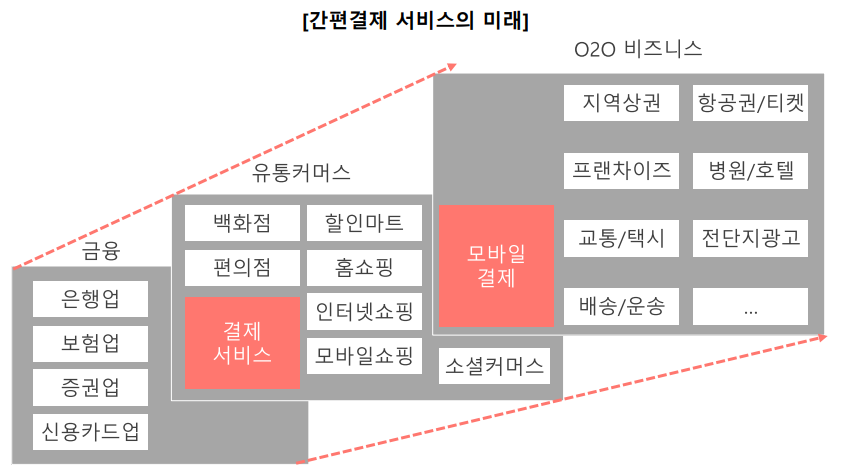
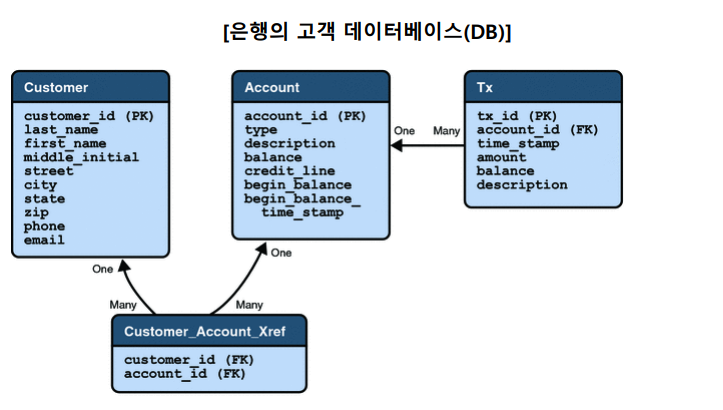
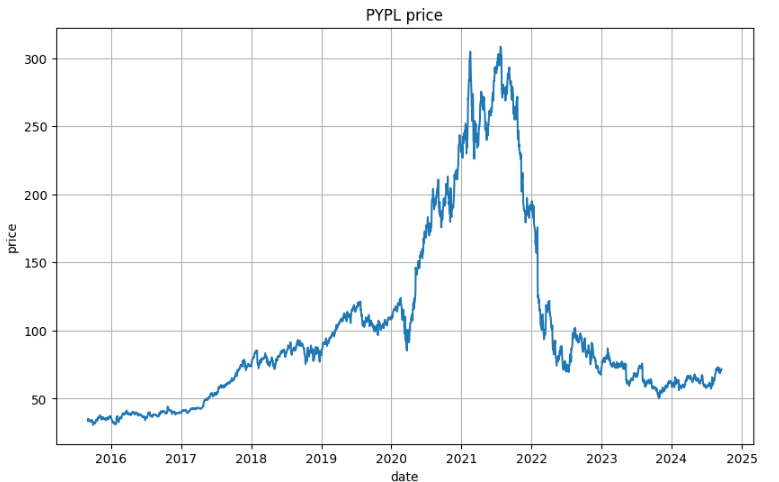

# 인공지능 모델 실습 (신용평가)

## 인공지능 모델



머신러닝은 통계나 수학적 모델을 기반으로 동작한다. <br/>
딥러닝은 생명체의 인지와 판단에 특화된 신경망을 기반으로 함.

chat-GPT같은 경우도 딥러닝 기반의 모델을 중심으로 제작됨.

<br/>

| **모델**                | **설명**                                                                            | **핀테크 활용 사례**                                 | 비고                                                            |     |
| ----------------------- | ----------------------------------------------------------------------------------- | ---------------------------------------------------- | --------------------------------------------------------------- | --- |
| SVM                     | 분류와 회귀 분석을 위한 알고리즘으로 데이터를 초평면으로 분리함                     | 사기 탐지, 신용 스코어링, 대출 승인 등               |                                                                 |     |
| KNN                     | 가장 가까운 이웃들의 레이블을 기반으로 예측을 수행하는 알고리즘                     | 고객 분류, 개인화된 금융 서비스, 부정 거래 탐지 등   | 이번 과정에서 실습 (보험금 청구 모델, 금융 상품 이탈 고객 예측) |     |
| Regression              | 입력과 출력 변수 간의 관계를 모델링하여 값을 예측하는 알고리즘                      | 금융 시장 예측, 자산 가격 예측, 이자율 예측 등       | 이번 과정에서 실습 (보험료 계산 모델)                           |     |
| Random Forest           | 의사결정 트리를 조합한 앙상블 모델로 더 강력한 예측을 수행함                        | 부정 거래 감지, 대출 채권 평가, 포트폴리오 최적화 등 |                                                                 |     |
| CNN                     | 이미지 분석에 특화된 딥 러닝 모델로 이미지 내 특징을 추출하고 분류함                | 수표 인식, 신분증 인증, 디지털 서명 검증 등          |                                                                 |     |
| RNN                     | 순차적인 데이터를 처리하는 딥 러닝 모델로 시계열 데이터 예측과 자연어 처리에 적합함 | 금융 시계열 데이터 예측, 고객 의견 분석 등           | 주가 예측 모델에서 실습                                         |     |
| Hierarchical Clustering | 데이터를 트리 구조로 분할하여 유사한 데이터를 그룹화함                              | 고객 세분화, 위험 프로파일링 등                      |                                                                 |     |
| k-means Clustering      | 데이터를 정의한 클러스터 수로 그룹화하는 클러스터링 기법                            | 고객 분류, 거래 패턴 분석, 마케팅 전략 수립 등       |                                                                 |     |
| PCA                     | 데이터의 차원을 줄이거나 주성분을 추출하여 데이터 변동을 설명함                     | 데이터 차원 축소, 고차원 데이터 시각화 등            |                                                                 |     |
| tSNE                    | 고차원 데이터를 저차원으로 매핑하여 시각화하는 기법으로 데이터 간 유사성을 보존함   | 고차원 데이터 시각화, 시장 분석 등                   |                                                                 |     |
| NMF                     | 비음수 행렬 분해를 통해 데이터의 특징을 추출함                                      | 신용 스코어링, 토픽 모델링, 고객 세분화 등           |                                                                 |     |

은행권에서는 주로 SVM, KNN, Regression을 사용. <br/>
디지털 서명 검증 부분에서 CNN을 가끔씩 사용.ㅎ

<br/>
<br/>

## 파이썬 프로그래밍

해당 관련 교육에서 프로그래밍 언어로 파이선을 채택한 이유.



지구에서 가장 많이 사용하는 프로그램이 언어. <br/>
전문가와 일반인 사이의 격차를 줄여주는 역할을 해내고 있음.

파이썬을 활용해 MACHINE LEARNING 부분에 대한 학습을 진행.

<br/>
<br/>

## 핀테크 데이터

### 1. 핀테크와 비즈니스

#### 핀테크 개념 및 비즈니스 종류

> 핀테크

핀테크는 금융(Financial)과 기술(Technology)의 합성어로 IT기술을 활용해 <br/>
서비스 구조, 제공 방식, 기법 등의 분야에서 차별화된 새로운 형태의 금융서비스를 제공하는 형태.

> 핀테크 서비스

모바일 결제, 모바일 송금, 온라인 개인 자산 관리, 크라우드 펀딩 등 다양한 업종이 존재. <br/>
페이팔(Pay-Pal)이 최초로 대중화에 성공해 주목받음.

<br/>

#### 핀테크 비즈니스 모델



핀테크 비즈니스 모델. <br/>
임의의 기업에서 신규 사업을 진행할 때, 기존 사업 모델을 재구성 할 때 자주 사용하는 모델.

> 채널

최근 채널계에서 혁신이 일어난 경우가 좀 있음.

- LOTTE ON vs. COUPANG

모바일 기기를 통한 접근성 향상. <br/>
AI 모델을 통한 사용자 맞춤 추천.

<br/>

- `NH스마트뱅킹` 앱

앱에 대한 평점이 5점과 1점이 압도적으로 많은 형태.

호불호가 심하게 갈리는 형태.

5점 comment에 대한 예시: 자본력을 통한 온보딩 프로모션에 대한 감사 <br/>
1점 comment에 대한 예시: 떨어지는 사용성에 대한 불편

<br/>

> 핀테크 비즈니스 모델: 금융 회사 기준



핀테크 업계는 금융에 대한 규제때문에 신규 사업이 급진적으로 업계 최고가 되는 경우는 일어나기 힘듦.

<br/>

> 핀테크 비즈니스 모델: 신용 및 담보를 기반으로 한 자금 대출

우리나라는 개인당 신용카드 개수가 굉장히 많은 나라. <br/>
현재도 외국에서는 신용카드를 발급하기 위해 굉장히 까다로운 조건을 요구함.

- '카카오' 대학생 대상 비상금 대출

대학생 개인별로 신용도를 파악할 수 있는 모델이 있다는 것.

<br/>

> 핀테크 비즈니스 모델: 간편결제 서비스



간편결제서비스 제공 기업들은 향후 간편 결제서비스 증가에 따른 수익 증가와 결제서비스를 기반으로 송금, 보험, 쇼핑 등 다양한 서비스를 연계하여 새로운 수익원을 창출할 수 있을 것으로 기대하고 있다.

따라서 관련 기업들은 모바일 간편 결제서비스를 단순히 결제만 대행하는 서비스에만 국한 하지 않고, 자체 비즈니스 플랫폼 확보의 기반으로 이용한다. <br/>
즉, 결제시스템에서 얻은 소비자 구매 데이터를 기반으로 더욱 정교한 타깃팅 광고 상품을 제공함으로써 광고 매출을 높이는 것이 서비스 제공 기업의 핵심 과제이다.

<br/>

### 2. 핀테크 서비스와 데이터



은행권 데이터 외 추가적인 데이터가 필요한 경우에 제공받는 플랫폼인 '마이데이터(MyData)'

- 지쿠, 스윙

사람이 실제로 움직이는 행동 반경을 통해 금융 사업으로 이어나가겠다는 내용이 사업계획서에 있음.

<br/>
<br/>

## 실습

### [파이썬: Colab](https://colab.research.google.com/?hl=ko)

#### 실습 기본 설정

파일 > Drive의 새 노트북 > 연결 (Cloud Computing 처럼 동작)

<br/>

#### 'PayPal' 주가 데이터 가져오기

> 야후 파이낸스 라이브러리 실행

```python
import yfinance as yf
```

<br/>

> 그래프 및 데이터프레임(엑셀형식의 데이터 작성) 지원 라이브러리 실행

```python
import pandas as pd
import matplotlib.pyplot as plt
```

<br/>

> 데이터를 받아오는 코드

```python
# 페이팔 주식 데이터를 가져옵니다.
# Get PayPal stock data.
start_date = '2015-09-01'
end_date = '2024-09-18'
ticker = 'PYPL' # ticker를 중심으로 주가 데이터 핸들링
data_pypl = yf.download(ticker, start=start_date, end=end_date)

# 페이팔 주식 데이터: 미리보기
data_pypl
```

<br/>

> 데이터프레임을 통한 데이터 필터링

```python
# 데이터프레임으로 변환.
df_pypl = pd.DataFrame(data_pypl['Close'])
df_pypl.columns = [ticker + 'price']
df_pypl.index.name = 'date'

# 시작일 이후의 데이터만 필터링.
df_pypl = df_pypl[df_pypl.index >= '2015-09-01']

# 기준 금리 데이터 : 미리보기
df_pypl
```

<br/>

> 데이터 메모리에 저장하기

```python
# 페이팔 주가 데이터를 CSV 파일로 저장
from google.colab import files

df_pypl.to_csv('pypl.csv', encoding='utf-8-sig')
files.download('pypl.csv') # 엑셀 형식으로 내 컴퓨터에 다운로드
```

<br/>

> 데이터를 차트로 표현하기

```python
# 차트(그래프) 작성
plt.figure(figsize=(10, 6))
plt.plot(df_pypl) # 그래프를 그리는 내용은 이거 하나

plt.title(ticker + ' price')
plt.xlabel('date')
plt.ylabel('price')
plt.grid(True)
plt.show()
```



<br/>
<br/>
